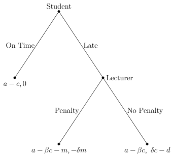

```{r setup, include=FALSE}
knitr::opts_chunk$set(echo = FALSE, message = FALSE, warning = FALSE, fig.width = 6, fig.height = 5, fig.pos="H", fig.pos = 'H')
```

<!-- ############################## -->
<!-- # Start Writing here: -->
<!-- ############################## -->
\newpage

# Introduction \label{intro} 

Every day people, firms and governments have to make decisions, and often their decisions depend on other people's decisions. For example, it's only useful for people and firms to accept the Rand as money, if other people and firms accept the Rand as money. Economists have long been interested in modelling human behaviour, and game theory has been developed as a tool to help us better understand situations where people interact with one another and make decisions [@book p.1]. One example of where game theory can be applied to explain how we make decisions is deadline adherence. At some stage in their lives, every person has had to submit an assignment, an essay or a report by some deadline. Game theory can offer insights as to when a person should submit work on time or late, even when there is incomplete information.

We investigate a case where a student is required to hand in an assignment but experiences a crisis before the deadline, and has to choose whether to submit her assignment on time or to hand in late. We impose a structure of continuous types for both players, with a discrete set of actions. This essay is structured as follows: section \ref{lit} briefly discusses the literature on games of incomplete information and some applications. Section \ref{game} presents the deadline adherence game theory model; and section \ref{result} analyses the results of the game. The final section concludes (\ref{con}).

# Games of Incomplete Information \label{lit} 

We follow the approach of @harsanyi in applying a game theoretic model of incomplete information, where players have less than full information about each others' payoff functions. Based on the Bayesian methodology, the two players have expectations in the form of subjective probability distributions. We use a lottery to assign types to players, before any moves are made in the game. The two players then try to estimate the probability of each others’ types, subject to the information that is commonly available. In order to solve the model, the game of incomplete information will be reinterpreted as a game with complete and imperfect information, by transforming the basic mathematical structure. 


# A Model of Deadline Adherence \label{game}

A student receives an assignment, which is due by a certain date set by the lecturer. While the student is working on the assignment, she undergoes a crisis and therefore spends less time on the assignment. She has two options: she can hand in the assignment on time or she can hand in late. If she hands in on time, she will get a payoff of $a-c$, where $a$ is the potential mark she would have received, and $c$ is the negative impact the crisis has on her mark. However, if she submits her project late, she has some time to recover after the crisis and reduce its academic impact. Her payoff is $a-\beta c -m$ if the lecturer gives her a penalty, where $m$ is the size of the penalty. She gets a payoff of $a-\beta c$ if there is no penalty. $\beta$ represents the type of the student, where a high $\beta$ suggests a low resiliency to crises and a low $\beta$ suggests a high resiliency and a better academic recovery.

On the other hand the lecturer is faced with the decision either to give a penalty ($m$) if a student submits late or not to give a penalty. If the lecturer gives a penalty, he feels bad since the student experienced a crisis. The size of this disutility depends on the size of the penalty and how empathetic the lecturer is - the lecturer's type ($\delta$). The more empathetic the lecturer is, the higher $\delta$ is. The lecturer's and student's types are independently and randomly chosen by nature at the start of the game from a uniform distribution
^[A uniform distribution puts equal chance on any of the outcomes between 0 and 1 happening.]: $\delta \sim {\sf Uniform}$ and $\beta \sim {\sf Uniform}$. If the lecturer

A summary of the game's parameter's and restrictions are shown in figure \ref{sum} below.

```{r sum, results = 'asis', warning=FALSE, message=FALSE, echo=FALSE}

library(xtable)
source("code/game_summary.R")
data<- game_summary()

table <- xtable(data, caption = "Summary of Game Parameters \\label{sum}")
  print.xtable(table,
             # tabular.environment = "longtable",
             floating = TRUE,
             table.placement = 'H',
             # scalebox = 0.3,
             comment = FALSE,
             caption.placement = 'bottom',
             include.rownames = FALSE,
             booktabs = T # Aesthetics
             )

```

<!-- The game starts off with nature randomly selecting the student's type ($\beta$), where $\beta \in [0,1]$ and the lecturer's type ($\delta \in [0,1]$). Each player knows her own type but not the type of the other player, making this a game of incomplete information. The order of play is as follows: the student moves first and can choose to hand in her assignment on time or late. Should she hand in on time, the game terminates. But if the student hands in late, the lecturer decides whether to impose a penalty or not to impose a penalty the student. -->

Figure \ref{tab1} shows the game in simultaneous format.

```{r tab1, results = 'asis', warning=FALSE, message=FALSE, echo=FALSE}

library(xtable)
source("code/simul.R")
data<- simul()

table <- xtable(data, caption = "Simultaneous Game \\label{tab1}")
  print.xtable(table,
             # tabular.environment = "longtable",
             floating = TRUE,
             table.placement = 'H',
             # scalebox = 0.3,
             comment = FALSE,
             caption.placement = 'bottom',
             include.rownames = TRUE,
             booktabs = T # Aesthetics
             )

```

Figure \ref{Figure1} shows the game below in extensive form:

```{r Figure1,  warning =  FALSE, fig.align = 'center', fig.cap = "Game Tree \\label{Figure1}", fig.ext = 'png', fig.height = 3, fig.width = 4}
library(knitr)  

```

# Results and Discussion \label{result}
 
 BR interperet
 Faults with game
 Run different examples


```{r tab2, results = 'asis', warning=FALSE, message=FALSE, echo=FALSE}

library(xtable)
source("code/game.R")
li <- game(a=0.8,c=0.15,B=0.2,D=0.2,m=0.05,d=0.09)
data <-li[[1]] 
br <- li[[2]]

table <- xtable(data, caption = "Simultaneous Game Best Response \\label{tab2}")
  print.xtable(table,
             # tabular.environment = "longtable",
             floating = TRUE,
             table.placement = 'H',
             # scalebox = 0.3,
             comment = FALSE,
             caption.placement = 'bottom',
             include.rownames = TRUE,
             booktabs = T # Aesthetics
             )
  
  tab <- xtable(br, caption = "Best Response\\label{tab3}")
  print.xtable(tab,
             # tabular.environment = "longtable",
             floating = TRUE,
             table.placement = 'H',
             # scalebox = 0.3,
             comment = FALSE,
             caption.placement = 'bottom',
             include.rownames = TRUE,
             booktabs = T # Aesthetics
             )

```

# Conclusion \label{con}

Extensions, generality
\newpage

# References {-}

<div id="refs"></div>

\newpage

# Appendix \label{app1} {-}

## Payoffs

__Student payoffs:__
\begin{align*}
E[\text{On Time}]&= a- c \\
E[\text{Late}]&=  p(a-\beta c-m) +(1-p)(a-\beta C) \\
&=-m p+a-\beta C
\end{align*}
Student plays on time if:
\begin{align*}
a-c>a-m p-\beta c \\
\beta c>c-m p \\
\beta>\frac{c-m p}{c}
\end{align*}
Student plays late if:
\begin{align*}
\beta<\frac{c-m p}{c}
\end{align*}
__Lecturer Payoffs:__
\begin{align*}
E[\text{Penalty}]&=q(-\delta m)+(1-q)(0) \\
&=q(-\delta m) \\
E[\text{No Penalty}] &=q(\delta c-d)+(1-a)(0) \\
&=q(\delta c-d)
\end{align*}
Lecturer gives a penalty if:
\begin{align*}
q(-\delta m)&>q(\delta c-d) \\
-\delta m&>\delta c-d \\
d&>\delta(c+m) \\
\delta&<\frac{d}{c+m} \\
\delta &<\bar{\delta}
\end{align*}
Lecturer gives no penalty if:
\begin{align*}
\delta &\geq \frac{d}{c+m} \\
\delta &\geq \bar{\delta} \\
\end{align*}
Solving for the best responses:
\begin{align*}
\therefore p=\bar{\delta}=\operatorname{Prob}(\delta<\bar{\delta})
\end{align*}
Substitute into the student's best response function - student hands in on time if:
\begin{align*}{}
\beta>\frac{c-m(\bar{\delta})}{c}
\end{align*}{}
Since $0 \leq \beta \leq 1$, $\beta$ cannot be greater than 1. This implies
\begin{align*}{}
\frac{c-m(\bar{\delta})}{c} \leq 1 \\
c-m \bar{\delta} \leq c \\
-m \bar{\delta} \leq 0 \\
0 \leq \bar{\delta}
\end{align*}{}
Since $0 \leq \bar{\delta} \leq 1$, this condition will always hold. 
